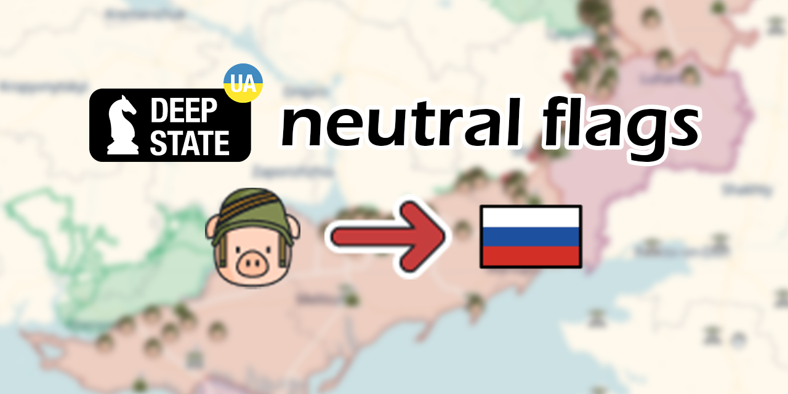

# DeepStateMap - Neutral Flags

Version: 1.1

Deutsche Version der readme siehe weiter unten.

## Purpose

This script was written for the (German) YouTube channel [Military & History with Torsten Heinrich](https://www.youtube.com/@MilitarGeschichte) so that it can pursue its neutral reporting.

The default setting of the DeepStateMap shows the Russian soldiers as pigs, the Belarusians as potatoes. While this may be in line with one's own view, it is a hindrance in neutral reporting.

I distance myself from any warfare and wish for nothing more than for Russia to withdraw.

Ukraine is a wonderful country with enchanting culture and interesting people.

Glory to Ukraine! Slava Ukraini!

## Installation

* Install [Greasemonkey for Firefox](https://addons.mozilla.org/de/firefox/addon/greasemonkey/) or [Tampermonkey for Chrome](https://www.tampermonkey.net/)

* Install the userscript. You can do this by clicking [here](https://github.com/Admonstrator/deepstatemap-flags/raw/main/deepstatemap-flags.user.js) or by copying the content of the file [deepstatemap-flags.user.js](https://github.com/Admonstrator/deepstatemap-flags/raw/main/deepstatemap-flags.user.js) into a new script in your userscript manager.

## Changelog

* v1.1
  * Improved performance like @rainbow365#6624 on Discord suggested

---

## Zweck

Dieses Skript wurde für den (deutschen) YouTube-Kanal [Militär & Geschichte mit Torsten Heinrich](https://www.youtube.com/@MilitarGeschichte) geschrieben, damit dieser seine neutrale Berichterstattung fortsetzen kann.

Die Standardeinstellung der DeepStateMap zeigt die russischen Soldaten als Schweine und die weißrussischen als Kartoffeln. Das mag zwar womöglich der eigenen Sichtweise entsprechen, ist aber für eine neutrale Berichterstattung hinderlich.

Ich distanziere mich von jeglicher Kriegsführung und wünsche mir nichts sehnlicher, als dass Russland sich zurückzieht.

Die Ukraine ist ein wunderbares Land mit einer bezaubernden Kultur und interessanten Menschen.

Ruhm für die Ukraine! Slava Ukraini!

## Installation

* Installieren Sie [Greasemonkey für Firefox](https://addons.mozilla.org/de/firefox/addon/greasemonkey/) oder [Tampermonkey für Chrome](https://www.tampermonkey.net/)

* Installieren Sie das Benutzerskript. Sie können dies tun, indem Sie [hier](https://github.com/Admonstrator/deepstatemap-flags/raw/main/deepstatemap-flags.user.js) klicken oder den Inhalt der Datei [deepstate-flags.user.js](https://github.com/Admonstrator/deepstatemap-flags/raw/main/deepstatemap-flags.user.js) in ein neues Skript in Ihrem Userscript-Manager kopieren.
